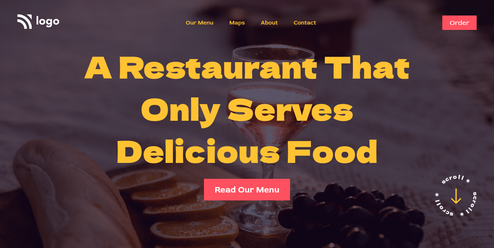

# This is a Landing page for a restaurant

Made by **Aditya Kadali**

## Screenshots:

## Built with:

- Semantic HTML
- CSS
- Flexbox

## Key Learnings:

- I learned to apply gradient over an image
- Use image as whole website background

## Time taken:

- It took me 1.5hrs to build this website.

## Links:
- [Live demo](https://restaurant-home.netlify.app/)
- [Source code](https://github.com/Adityakadali/restaurant-landing-page)